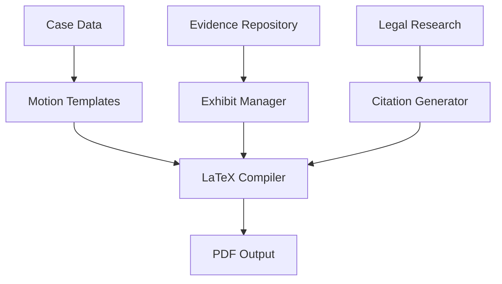

# Legal Motion Automation System

## Overview
Advanced legal document generation system designed for Hawaii Family Court proceedings, featuring automated motion templates, LaTeX compilation, and cross-platform integration.

## Features

### Motion Generation
- **Hawaii Court Compliance**: All templates follow Hawaii Family Court formatting standards
- **LaTeX Integration**: Professional document compilation with proper legal formatting
- **Automated Citations**: Dynamic case law and statute referencing
- **Evidence Management**: Automated exhibit compilation and indexing

### Platform Integration
- **GitHub**: Version control for all legal documents
- **Linear**: Strategic issue tracking and workflow management
- **Notion**: Knowledge base and motion templates
- **Email**: Communication tracking and client updates
- **Slack**: Team coordination and case updates

### Document Types Supported
- Motion to Compel Discovery
- Motion for Sanctions
- Motion to Modify Custody
- Emergency Motions
- Protective Order Applications
- Settlement Conference Statements

## Quick Start

1. Clone the repository
2. Install dependencies: `pip install -r requirements.txt`
3. Configure platform integrations in `config/settings.yaml`
4. Run the motion generator: `python generate_motion.py --type compel`

## Case Integration
Currently optimized for Case 1FDV-23-0001009 with automatic evidence compilation and contradiction detection.

## Architecture

## Contributing
See CONTRIBUTING.md for development guidelines and code standards.

## License
MIT License - See LICENSE file for details.